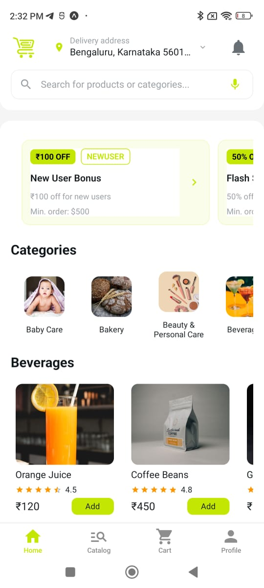
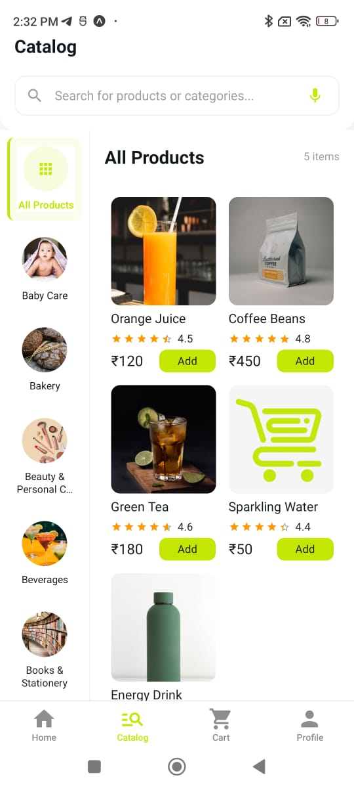
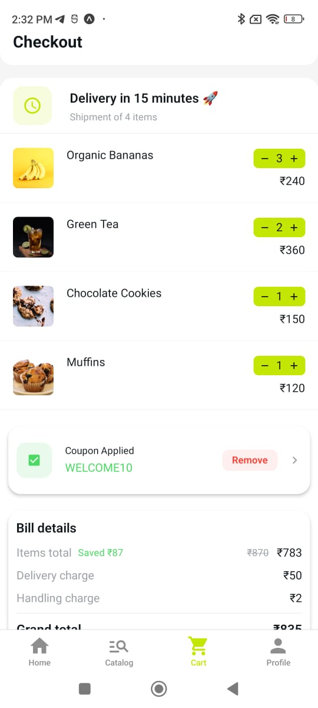
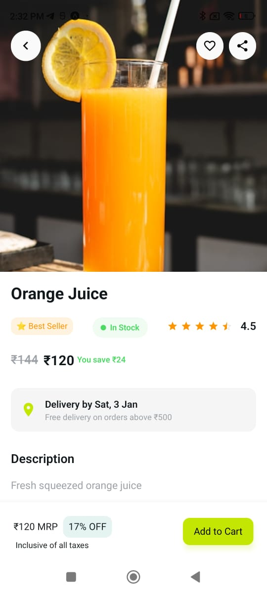
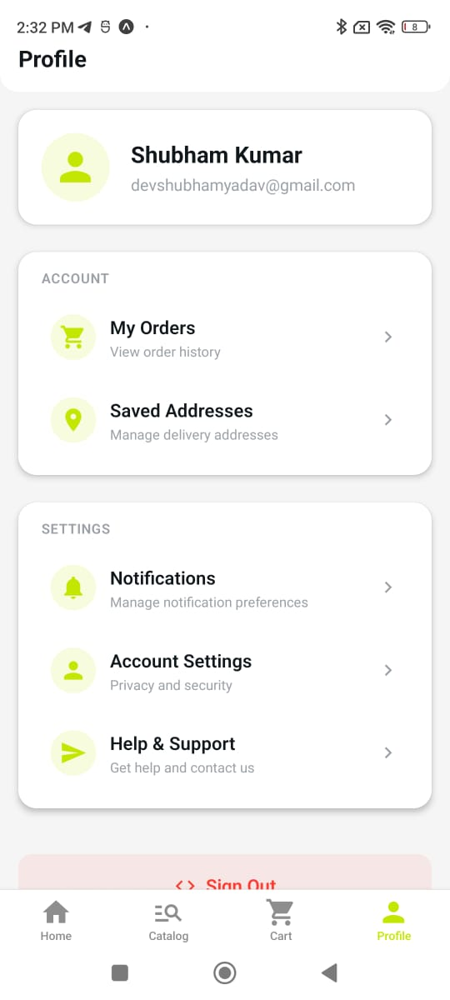

# QuickShop - Quick Commerce Mobile App

A modern, full-featured quick commerce mobile application built with React Native, Expo, and Supabase. QuickShop provides a complete shopping experience with instant delivery, real-time inventory updates, secure payments, order tracking, and more.

## 🚀 Features

### Core Features

- **User Authentication** - Secure email/password authentication with Supabase
- **Product Catalog** - Browse products by category with search functionality
- **Shopping Cart** - Add, remove, and manage items with offline support
- **Wishlist** - Save favorite products for later
- **Order Management** - Track orders from placement to delivery
- **Address Management** - Save and manage multiple delivery addresses
- **Payment Integration** - Razorpay payment gateway integration (Card, UPI, Wallet, Cash on Delivery)
- **Real-time Updates** - Live inventory updates via Supabase Realtime
- **Offline Support** - Cache products and cart for offline access
- **Dark Mode** - Beautiful light and dark theme support

### Technical Features

- **Redux Toolkit** - Centralized state management
- **TypeScript** - Full type safety
- **Expo Router** - File-based routing
- **Supabase** - Backend as a Service (Auth, Database, Realtime)
- **Image Optimization** - Lazy loading and caching with expo-image
- **Error Boundaries** - Graceful error handling
- **Form Validation** - Input validation and error handling

## 📸 Screenshots

<div align="center">

|                        Home Screen                         |                         Product Catalog                         |
| :--------------------------------------------------------: | :-------------------------------------------------------------: |
|  |  |

|                        Shopping Cart                         |                             Product Details                              |
| :----------------------------------------------------------: | :----------------------------------------------------------------------: |
|  |  |

|                          User Profile                          |
| :------------------------------------------------------------: |
|  |

</div>

## 📋 Prerequisites

- Node.js 18+ and npm/yarn
- Expo CLI (`npm install -g expo-cli`)
- Expo Go app on your mobile device (for development)
- Supabase account (for backend services)
- Razorpay account (for payments - optional)

## 🛠️ Tech Stack

- **Framework**: React Native with Expo
- **Language**: TypeScript
- **State Management**: Redux Toolkit
- **Navigation**: Expo Router (file-based routing)
- **Backend**: Supabase (Auth, Database, Realtime)
- **Payment**: Razorpay SDK
- **UI Components**: Custom themed components
- **Image Loading**: expo-image
- **Lists**: FlashList for optimized rendering
- **Caching**: AsyncStorage for offline support

## 📦 Installation

1. **Clone the repository**

   ```bash
   git clone <repository-url>
   cd quickshop
   ```

2. **Install dependencies**

   ```bash
   npm install
   ```

3. **Set up environment variables**

   Create a `.env` file in the root directory:

   ```env
   # Supabase Configuration
   EXPO_PUBLIC_SUPABASE_URL=your_supabase_project_url
   EXPO_PUBLIC_SUPABASE_KEY=your_supabase_anon_key

   # Razorpay Configuration (optional)
   EXPO_PUBLIC_RAZORPAY_KEY_ID=your_razorpay_key_id
   EXPO_PUBLIC_API_URL=https://your-backend-api.com

   # App Scheme (for deep linking)
   EXPO_PUBLIC_APP_SCHEME=quickshop
   ```

4. **Set up Supabase Database**

   - Create a new project at [supabase.com](https://supabase.com)
   - Run the database schema script:
     - Go to SQL Editor in Supabase Dashboard
     - Copy and run `scripts/sql/schema.sql` to create all tables
   - Seed initial data:
     - Copy and run `scripts/sql/seed.sql` to add sample products, categories, and offers
   - Or use the TypeScript seed script:
     ```bash
     npm install -D typescript tsx @types/node dotenv
     npx tsx scripts/seed-database.ts
     ```

   See `DATABASE_SETUP.md` for detailed instructions.

5. **Start the development server**
   ```bash
   npm start
   # or
   npx expo start
   ```

## 🏃 Running the App

### Development Options

1. **Expo Go** (Recommended for quick testing)

   - Install Expo Go on your device
   - Scan the QR code from the terminal

2. **Android Emulator**

   ```bash
   npm run android
   ```

   Requires Android Studio and an AVD set up.

3. **iOS Simulator** (macOS only)

   ```bash
   npm run ios
   ```

   Requires Xcode and iOS Simulator.

4. **Web**
   ```bash
   npm run web
   ```

## 📁 Project Structure

```
quickshop/
├── src/
│   ├── app/                    # Expo Router pages
│   │   ├── (tabs)/            # Tab navigation screens
│   │   │   ├── index.tsx      # Home screen
│   │   │   ├── catalog.tsx    # Product catalog
│   │   │   ├── cart.tsx       # Shopping cart
│   │   │   ├── wishlist.tsx   # Wishlist
│   │   │   ├── orders.tsx     # Order history
│   │   │   └── profile.tsx     # User profile
│   │   ├── sign-in.tsx        # Sign in screen
│   │   ├── sign-up.tsx        # Sign up screen
│   │   ├── checkout.tsx       # Checkout screen
│   │   ├── product/[id].tsx   # Product details
│   │   └── order/[id].tsx     # Order details
│   ├── components/            # Reusable components
│   │   ├── cards/            # Card components
│   │   ├── ui/               # UI components
│   │   └── ...
│   ├── store/                # Redux store
│   │   ├── slices/           # Redux slices
│   │   │   ├── authSlice.ts
│   │   │   ├── productsSlice.ts
│   │   │   ├── cartSlice.ts
│   │   │   ├── ordersSlice.ts
│   │   │   └── ...
│   │   └── index.ts
│   ├── services/             # Service modules
│   │   └── razorpay.ts       # Payment integration
│   ├── utils/                # Utility functions
│   │   ├── supabase.ts       # Supabase client
│   │   └── cache.ts          # Caching utilities
│   ├── constants/            # Constants
│   │   └── Colors.ts         # Theme colors
│   ├── types/                # TypeScript types
│   │   └── index.ts
│   └── hooks/                # Custom hooks
├── app.json                  # Expo configuration
├── package.json
└── README.md
```

## 🔧 Available Scripts

- `npm start` - Start Expo development server
- `npm run android` - Run on Android emulator/device
- `npm run ios` - Run on iOS simulator (macOS only)
- `npm run web` - Run in web browser
- `npm run lint` - Run ESLint

## 🔐 Environment Variables

Required environment variables are listed in `.env.example`. Make sure to:

1. Never commit `.env` files to version control
2. Use `.env.local` for local overrides
3. Set up environment variables in your deployment platform

## 💳 Payment Integration

This app uses Razorpay for payment processing. To enable payments:

1. **Set up Razorpay account**

   - Sign up at [razorpay.com](https://razorpay.com)
   - Get your Key ID and Key Secret

2. **Backend API Required**

   - Create endpoints for order creation: `POST /api/razorpay/create-order`
   - Create endpoints for payment verification: `POST /api/razorpay/verify-payment`
   - Never expose your Key Secret in the client app

3. **Environment Variables**
   ```env
   EXPO_PUBLIC_RAZORPAY_KEY_ID=your_key_id
   EXPO_PUBLIC_API_URL=https://your-backend-api.com
   ```

See the code comments in `src/services/razorpay.ts` for implementation details.

## 🗄️ Database Schema

The app expects the following Supabase tables:

- `products` - Product catalog
- `categories` - Product categories
- `orders` - User orders
- `order_items` - Order line items
- `cart_items` - Shopping cart items
- `addresses` - User delivery addresses
- `wishlist_items` - User wishlist
- `payments` - Payment records
- `offers` - Promotional offers

## 🎨 Theming

The app supports light and dark themes with automatic system detection. Theme colors are defined in `src/constants/Colors.ts`.

## 🐛 Troubleshooting

### Common Issues

1. **"No Android device found"**

   - Use Expo Go on your phone, or
   - Set up an Android emulator in Android Studio

2. **"INSTALL_FAILED_USER_RESTRICTED" or "Install canceled by user"**

   - **For Development Builds**: Enable "Install unknown apps" in Android Settings
     - Go to Settings → Security → Enable "Unknown sources" or
     - Settings → Apps → Special access → Install unknown apps
   - **Easier Solution**: Use Expo Go instead (no installation needed)
     - Install Expo Go from Play Store
     - Scan QR code from `npm start`

3. **"No development build installed"**

   - You need to build a development build first:
     ```bash
     npx expo prebuild
     npx expo run:android
     ```
   - Or use Expo Go for simpler development

4. **"Supabase URL/Key not found"**

   - Check your `.env` file
   - Ensure variables start with `EXPO_PUBLIC_`

5. **"Payment integration errors"**
   - Ensure backend API endpoints are set up
   - Check Razorpay Key ID is configured
   - Verify payment verification is done on backend

## 📝 Development Notes

- **Expo Go Compatible**: All features work in Expo Go without requiring a development build
- **Offline Support**: Products and cart are cached locally for offline access
- **Real-time Updates**: Inventory changes are synced in real-time via Supabase Realtime
- **Error Handling**: Error boundaries catch and display errors gracefully

## 🤝 Contributing

Contributions are welcome! Please:

1. Fork the repository
2. Create a feature branch
3. Make your changes
4. Submit a pull request

## 📄 License

This project is private and proprietary.

## 👤 Author

Built with ❤️ using React Native and Expo

## 🔗 Resources

- [Expo Documentation](https://docs.expo.dev/)
- [Supabase Documentation](https://supabase.com/docs)
- [Razorpay Documentation](https://razorpay.com/docs/)
- [React Native Documentation](https://reactnative.dev/)
- [Redux Toolkit Documentation](https://redux-toolkit.js.org/)

---

**Note**: This is a development version. For production deployment, ensure:

- Environment variables are properly configured
- Backend APIs are set up and secured
- Database migrations are run
- Payment gateway is properly integrated
